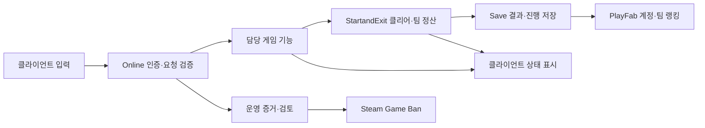

# 시스템 구조 설계

문서 ID: ARCH-0001 · 버전: 1.0 · 2026-09-17  
상태: 구현 전 기술 명세

## 구조와 책임

Unity 클라이언트는 입력·로컬 예측·화면·소리를 담당한다. PlayFab Multiplayer Servers에서 실행되는 운영자 전용 서버가 게임 상태의 최종 판정권을 갖는다. 방장은 방 운영 역할을 가진 일반 참가자다.

각 기능은 자신의 규칙과 상태를 소유한다. UI나 다른 기능이 내부 값을 직접 덮어쓰지 않고 요청과 확정된 사건으로 연결한다. Core에는 실제로 공통인 ID·시간·결과 형식만 둔다. 구체 클래스·asmdef·네트워크 SDK는 구현 단계에서 고정한다.

| 기능 | 서버의 최종 책임 | 클라이언트·저장 경계 |
|---|---|---|
| Player | 유효 이동, 체력·다운·사망·부활 | 입력·예측·확정 상태 표시 |
| Cooperation | 구조·끌어올리기·협동 조건 | 생존 변경은 Player와 연결 |
| Interaction | 거리·대상·접근 권한 | 조준 표시가 성공을 확정하지 않음 |
| Items | 소유권·획득·소모·전달 | 재전송으로 이중 지급/소모 금지 |
| Puzzles | 필수 역할·장치 성공·출구 개방 | 시작 인원 기준을 사망으로 축소하지 않음 |
| Monster | 인식·추적·공격·보스 상태 | 몬스터 처치 점수 없음 |
| MapGeneration | 방·통로·아이템 배치와 진행 가능성 | 시드·콘텐츠 버전과 결과 연결 |
| StartandExit | 런·출구 타이머·도착자·점수·전환 | 팀 결과를 한 번 확정 |
| Story | 플레이 사건에 따른 이야기 진행 | 번역은 Localization, 표시는 UI |
| Online | Steam 인증·연결·동기화·요청 권한 | 서버 비밀 키를 클라이언트에 두지 않음 |
| Save | 서버 승인 데이터 저장·버전·복구 | 계정·런·경쟁 데이터 분리 |
| UI | 서버 결과 표시·로컬 설정 | 클리어·점수·제재 판정권 없음 |

## 출구와 상태 일관성

[출구 설계](DESIGN-0001-StageExit.md)의 시작 명단, 최초 도착 T0, T0+5초, 실제 도착 집합, 마감 시각·이유를 서버가 소유한다. 정산 후 데이터는 늦은 요청으로 변경하지 않는다.

단발 요청은 requestId와 처리 결과를 연결해 재전송을 중복 적용하지 않는다. 반복 가능한 행동은 서로 다른 유효 요청이어야 하며 대상 상태·쿨다운·소유권을 다시 검증한다. 네트워크가 정확히 한 번 전달된다고 가정하지 않는다.

정산에는 runId·stageId·settlementId를 연결한다. 같은 정산의 저장 재시도는 같은 결과를 반환하고, 동일 ID의 다른 내용은 충돌로 다룬다. 저장 실패를 성공으로 표시하지 않는다.

## 접속과 방장 변경

플레이어가 나가도 남은 참가자는 진행한다. 방장 이탈 시 남은 참가자에게 방장 역할을 넘기고 서버 런·출구 타이머·점수를 유지한다. 중도 합류는 다음 안전 구간에서 처리한다. 재접속 유예와 안전 구간의 정확한 조건은 상세 결정 대상이다.

서버 장애는 방장 이탈과 다른 사건이다. 런 복원을 도입한다면 서버 상태 복구·이전 권한 만료·단일 정산을 검증해야 한다. 복원 주기·복구 목표·비용은 미정이다.

## 데이터와 버전

아래는 논리 데이터 계약이며 물리 DB 테이블 설계는 아니다.

| 데이터 | 필수 내용 | 수명·권한 |
|---|---|---|
| 계정 | Steam 연동 ID, 설정, 해금, 업적, 이야기 진행 | 계정 소유. 서버 검증 후 저장 |
| 런 | 참가자, 챕터·스테이지, 생존 상태, 출구 상태, 임시 점수 | 서버 런 동안 유지. 전멸 후 초기화 |
| 팀 결과 | 팀 ID, 참가자 Steam ID, 챕터·결과·총점·시간, 규칙 버전 | 서버 승인 결과만 경쟁 기록으로 저장 |
| 사건 | caseId, 계정·런 참조, 시각, 검증 근거, 조치·심사·이의제기 | 접근을 제한한 운영 기록 |

| 버전 필드 | 의미 |
|---|---|
| schemaVersion | 저장 데이터 구조 |
| contentVersion | 콘텐츠 묶음·데모/정식 구분 |
| scoreRuleVersion | 점수 공식과 인정 조건 |
| gameBuildVersion | 실행 빌드 |
| migrationVersion | 적용한 데이터 변환 이력 |

새 스키마는 시험 데이터로 순차 변환하고 이전 정상 상태의 복구 지점을 둔다. 실패한 변환은 정상 데이터를 덮어쓰지 않는다. 롤백은 클라이언트·서버 빌드와 스키마 호환성을 함께 확인한다. 점수 공식이 다른 기록과 데모·정식 랭킹은 분리한다.

## PlayFab 경계

PlayFab은 Steam 인증 연결, 서버 할당, 계정 데이터, 팀 결과·랭킹 저장과 연결한다. 실제 SDK 조합·API·계정 구성·지역·예산은 미확정이다. 서버는 이동과 장치 상태를 검증하고 클라이언트 점수를 그대로 업로드하지 않는다.

한국 우선 지역과 대체 지역은 실제 콘솔의 가용성·견적·지연을 시험한 후 결정한다. 월비용은 VM·가동 시간·동시 서버·유휴 용량·네트워크·저장/API 사용량을 함께 측정한다.

## 보안과 제재

서버 권위 검증과 Steam Game Ban을 사용한다. 외부 PC 안티치트 제품·파일 삭제 기능은 도입하지 않는다. Steam Game Ban 자체가 로컬 핵 프로그램을 탐지한다고 가정하지 않는다.

확인된 핵은 현재 세션에서 즉시 추방한다. 장기 계정 제한은 Steam 계정과 사건 증거를 운영자가 검토한다. 자동 탐지 한 번·신고·IP·전화번호·PC 일치만으로 자동 영구 정지하지 않는다. 정상 지연·게임 버그·서비스 장애를 별도로 조사한다.

사건에는 계정 참조, runId, 시각, build/rule 버전, 검증 근거, 조치 범위·만료, 심사자, 이의제기·복구 결과를 남긴다. Game Ban 호출과 운영 키는 신뢰된 서버에서만 사용한다. 상세 기간·수집/보관·권한 정책은 [개발 상태](PROJECT_STATE.md)에서 관리한다.

방장 추방·보안 추방·채팅/음성 제한·Game Ban·기록 무효화는 구분한다. 이용자 안내에는 이해할 수 있는 사유와 문의 경로를 제공하고, 다른 이용자의 정보와 탐지 우회용 비밀은 노출하지 않는다.

## 구현과 검증 순서

1. Editor·manifest·lock을 고정하고 실제 Unity 프로젝트를 구성한다.
2. 이동·협동·출구의 작은 규칙과 씬을 구현한다.
3. PlayFab 전용 서버와 2·3·4인 클라이언트를 연결한다.
4. 지연·손실·재전송·끊김·방장 이탈·서버 장애를 검증한다.
5. 저장 마이그레이션, 점수 위조 차단, 제재 오탐·이의제기 복구를 검증한다.
6. 별도 시험 환경에서 부하·빌드·배포·롤백을 확인한다.

서비스 구조는 구현 전 명세다. 로컬 프로토타입과 PlayMode 검사는 실행 가능한 상태로 확장 중이며, 그 판정권을 PlayFab 서버 판정권으로 혼동하지 않는다. 각 단계의 실제 완료는 [검증 기록](Testing/README.md)으로 남긴다.

### 서비스 계정 준비 전 로컬 검증

2026-09-19 사용자 결정에 따라 3단계 전에 별도 로컬 전용 서버와 실제 2~4개 클라이언트를 검증한다. Netcode for GameObjects 2.13.2·Unity Transport 6.6.0은 이 개발 시험의 패키지 조합이며 정식 SDK 결정은 아니다. 접속 승인·고정 명단·방장 역할·준비/챕터 선택·요청 검증은 서버가 소유하고 클라이언트는 결과를 표시한다. 계정 인증 없는 loopback 통신을 Steam/PlayFab 인증으로 취급하지 않는다.

후속 연결에서 서버는 고정 연결 ID별 입력을 tick에서 소비하며, 클라이언트는 시드 기반 표시 전용 맵과 서버 상태 복제를 사용한다. 클라이언트 충돌·게임 판정·시험 동료 AI는 비활성화하고 자기 카메라·현재 키 표시만 로컬로 처리한다. 방 관리와 2/3/4인 챕터 시작·이동 격리는 [TEST-0007](Testing/TEST-0007-NetworkWorldReplica.md), 서버 시험 배치 완료/로컬 저장/이야기 합의는 [TEST-0009](Testing/TEST-0009-NetworkCompletion.md), 일반 로비 연결은 [TEST-0010](Testing/TEST-0010-LocalLobbyEntry.md)에서 구분한다. 전체 코스 실제 입력 완주·클라우드 저장·지연/손실 대응은 남아 있다.

전멸 후 클라이언트 임시 상태 초기화와 기존 위험 영역의 서버 발 위치 판정은 [TEST-0011](Testing/TEST-0011-NetworkWipeRetry.md)을 따른다. 위험 판정은 고정 틱에서 서버가 가진 참가자·몬스터 위치와 Collider 내부 여부를 대조하며 표시 전용 복제는 실행하지 않는다. UI/물리 시험 통과를 Steam/PlayFab 운영 준비로 확대하지 않는다.

[통합 기획서](../Plan.md) · [폴더 지도](FOLDER_MAP.md) · [파이프라인](PIPELINE.md)
